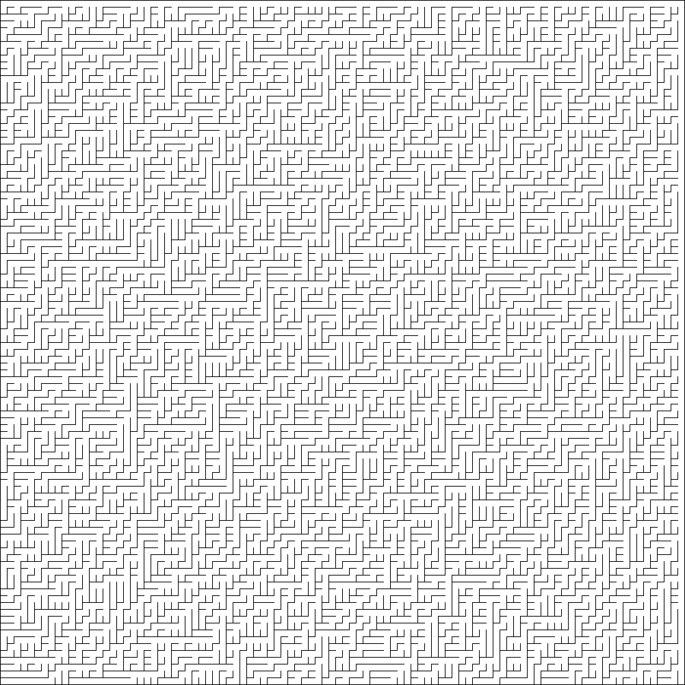

# When lost read here....

Work along with the book about mazes [Mazes for
Programmers](https://www.google.com/search?&q=mazes+for+programmers&oq=mazes+for+programmers)
but in python and maybe I go nuts sometimes.

## Binary Tree method

The binary tree carves out a maze, by going through each cell and randomly
removes the NORTH or EAST wall.

```python
from generics.grid import Grid
from creators.binary_tree import BinaryTree

grid = Grid(100,100)
bt = BinaryTree(grid)
maze = bt.create()
maze.to_png()



```
